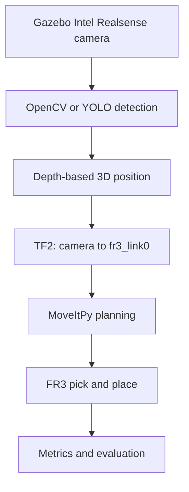

# FR3 Vision-Guided Sorting Cell


A step-by-step robotics experiment for building a **vision-guided sorting cell** with a **Franka Research 3 (FR3)**, **Intel RealSense RGB-D camera**, **ROS 2 Jazzy**, **MoveItPy**, **Gazebo Harmonic**, **OpenCV**, and **Docker**.

The target system detects red, green, and blue objects on a table, estimates each object's 3D position, transforms the position into the FR3 base frame, and uses collision-aware motion planning to place each object into the correct container.

> **Current status:** the Docker development environment and full implementation roadmap are available. The perception, calibration, simulation, and automatic sorting nodes will be added incrementally and validated one stage at a time.

## Quick start with Docker

Run the following commands in an **Ubuntu host terminal**:

```bash
cd ~

git clone https://github.com/ytang19-glitch/FR3-Vision-Guided-Sorting-Cell.git fr3_vision_sorting

cd ~/fr3_vision_sorting
```

The last argument in the `git clone` command creates a local folder named `fr3_vision_sorting`. It is a folder on your computer, not another folder shown inside the GitHub repository.

Then build and start the environment:

```bash
xhost +local:docker
docker compose build
docker compose up -d
docker exec -it fr3_vision_sorting bash
```

After entering the container, the repository is available at:

```text
/workspace
```

For the complete explanation, see [DOCKER_SETUP.md](DOCKER_SETUP.md).

## Project overview

This experiment connects the complete industrial robotics pipeline:



The first implementation uses simple colored objects because this makes every subsystem easy to inspect. After the complete pipeline works, OpenCV color detection can be replaced by YOLO or instance segmentation without changing the TF2 and MoveIt stages.

## Core features

- Official Franka FR3 URDF/Xacro model through `franka_description`.
- FR3 motion planning through MoveIt 2 and MoveItPy.
- Intel RealSense RGB, aligned depth, camera information, and point cloud.
- OpenCV HSV detection for red, green, and blue objects.
- Depth projection from image pixel `(u,v)` to camera-frame position `(X,Y,Z)`.
- TF2 transformation from `camera_color_optical_frame` to `fr3_link0`.
- Eye-to-hand calibration for a fixed overhead RealSense camera.
- Collision-aware table, object, camera stand, and sorting-bin representation.
- Gazebo simulation before transfer to the real FR3.
- Docker environment containing ROS 2 Jazzy, Gazebo, MoveIt, RealSense, and OpenCV.
- Experiment logging for localization error, grasp success rate, and cycle time.

**Keywords:** robotics, ROS 2, Franka Research 3, MoveItPy, Gazebo, RealSense, OpenCV, RGB-D perception, TF2, pick-and-place, Docker

## Current progress

| Stage | Status | Completion test |
|---|---|---|
| Docker environment | ✅ Added | Image definition, Compose configuration, USB and GUI setup |
| FR3 project roadmap | ✅ Added | Full simulation-to-real workflow documented |
| Relevant research papers | ✅ Added | Project-related papers collected |
| RealSense hardware detection | 🔄 Testing | Camera appears in `lsusb` and `rs-enumerate-devices` |
| RGB/depth ROS topics | ⬜ Planned | Color, aligned depth, CameraInfo and point cloud available |
| Fixed-coordinate MoveIt grasp | ⬜ Planned | Ten successful simulated cycles |
| OpenCV object detection | ⬜ Planned | Stable class and center-pixel output |
| 3D localization and TF2 | ⬜ Planned | RViz marker appears on the physical object |
| Gazebo sorting cell | ⬜ Planned | Thirty successful simulated sorting cycles |
| RealSense hand-eye calibration | ⬜ Planned | Mean localization error below 10 mm |
| Real FR3 sorting | ⬜ Planned | Safe low-speed sorting of three objects |

## Repository structure

```text
FR3-Vision-Guided-Sorting-Cell/
├── Dockerfile                  # ROS 2 Jazzy development image
├── compose.yaml                # USB, GUI, network and workspace configuration
├── start_container.sh          # Automatically sources ROS environments
├── .dockerignore               # Excludes generated files from Docker builds
├── DOCKER_SETUP.md             # Build-your-own-Docker tutorial
├── README.md                   # Project overview and experiment workflow
├── Relevant_papers.md          # Papers related to vision-guided manipulation
└── ros2_ws/
    └── src/
        └── README.md           # ROS package creation command
```

The planned ROS package structure is:

```text
ros2_ws/src/fr3_vision_sorting/
├── config/
│   ├── objects.yaml
│   ├── sorting_bins.yaml
│   └── moveit_py.yaml
├── launch/
│   ├── simulation.launch.py
│   ├── vision.launch.py
│   └── real_robot.launch.py
├── models/
├── urdf/
│   └── sorting_cell.urdf.xacro
├── worlds/
│   └── sorting_world.sdf
├── fr3_vision_sorting/
│   ├── color_detector.py
│   ├── depth_to_point.py
│   ├── object_pose_transformer.py
│   ├── planning_scene_node.py
│   ├── pick_place_node.py
│   └── metrics_logger.py
├── package.xml
├── setup.cfg
└── setup.py
```

## Installation option A — Docker (recommended)

Docker gives every student the same ROS 2, MoveIt, Gazebo, RealSense, and OpenCV environment.

For the detailed explanation of every file and command, read:

> [Build Your Own Docker Environment](DOCKER_SETUP.md)

### 1. Clone the repository

```bash
cd ~
git clone https://github.com/ytang19-glitch/FR3-Vision-Guided-Sorting-Cell.git fr3_vision_sorting
cd ~/fr3_vision_sorting
```

### 2. Allow GUI applications

Run on the Ubuntu host:

```bash
xhost +local:docker
```

### 3. Build the image

```bash
docker compose build
```

The image name is:

```text
fr3-vision-sorting:jazzy
```

### 4. Start and enter the container

```bash
docker compose up -d
docker exec -it fr3_vision_sorting bash
```

The container name is:

```text
fr3_vision_sorting
```

### What the Docker image contains

| Component | Purpose |
|---|---|
| ROS 2 Jazzy Desktop | ROS nodes, tools, RViz and development environment |
| Gazebo / `ros_gz` | Robot and RGB-D sensor simulation |
| MoveIt 2 / MoveItPy | Motion planning and execution |
| RealSense ROS driver | RGB, depth, CameraInfo and point cloud |
| OpenCV / `cv_bridge` | Image processing and ROS image conversion |
| TF2 tools | Camera-to-robot coordinate transformation |
| Colcon / rosdep | ROS package dependency installation and building |

The Compose file mounts the repository into the container:

```text
Host:      ~/fr3_vision_sorting
Container: /workspace
```

Therefore, source code remains on the host even if the container is recreated.

## Installation option B — Native ROS 2

Use this method only when ROS 2 Jazzy and the required Franka packages are already installed directly on Ubuntu 24.04.

> [Build Your ROS 2 Workspace and Package](ros2_ws/src/README.md)

```bash
mkdir -p ~/franka_ros2_ws/src
cd ~/franka_ros2_ws/src

ros2 pkg create fr3_vision_sorting \
  --build-type ament_python \
  --dependencies \
  rclpy \
  geometry_msgs \
  sensor_msgs \
  visualization_msgs \
  moveit_msgs \
  shape_msgs \
  tf2_ros \
  tf2_geometry_msgs \
  cv_bridge
```

Install dependencies and build:

```bash
cd ~/franka_ros2_ws
rosdep install --from-paths src --ignore-src -r -y
colcon build --symlink-install
source install/setup.bash
```

## First experiment — Test the RealSense

Do not move the real FR3 in the first experiment. First verify the complete camera data path.

### 1. Check the camera on the Ubuntu host

Connect the RealSense and run:

```bash
lsusb | grep -Ei 'intel|realsense|8086'
```

The camera used for this experiment has now been detected successfully:

```text
ID 8086:0b5b Intel Corp. Intel(R) RealSense(TM) Depth Camera 405
```

The bus and device numbers, such as `Bus 001 Device 002`, may change after reconnecting the camera. The stable identifier is the USB ID `8086:0b5b`.

Optional live USB monitoring:

```bash
watch -n 1 lsusb
```

Next, confirm that Docker can access the same device:

```bash
cd ~/fr3_vision_sorting
docker compose up -d
docker exec -it fr3_vision_sorting bash
lsusb | grep -Ei 'intel|realsense|8086'
```

Expected result inside Docker:

```text
Intel(R) RealSense(TM) Depth Camera 405
```

Inspect the camera through librealsense:

```bash
rs-enumerate-devices
```

If the D405 appears on the host but not inside Docker, check that `compose.yaml` includes:

```yaml
privileged: true
volumes:
  - /dev/bus/usb:/dev/bus/usb
```

### 2. Start the RealSense ROS node

Inside the container:

```bash
ros2 launch realsense2_camera rs_launch.py \
  align_depth.enable:=true \
  pointcloud.enable:=true \
  enable_sync:=true
```

### 3. Check the ROS topics

In a second terminal:

```bash
docker exec -it fr3_vision_sorting bash
ros2 topic list | grep camera
```

Expected topics include:

```text
/camera/camera/color/image_raw
/camera/camera/color/camera_info
/camera/camera/aligned_depth_to_color/image_raw
/camera/camera/depth/color/points
```

Check the stream rates:

```bash
ros2 topic hz /camera/camera/color/image_raw
ros2 topic hz /camera/camera/aligned_depth_to_color/image_raw
```

### 4. View RGB, aligned depth, and point-cloud data

Keep the RealSense launch command running in the first terminal. Open a second terminal and enter the container:

```bash
docker exec -it fr3_vision_sorting bash
source /opt/ros/jazzy/setup.bash
```

#### 4.1 Verify `rqt_image_view`

```bash
dpkg -l | grep ros-jazzy-rqt-image-view
ros2 pkg prefix rqt_image_view
```

If the package is missing, install it:

```bash
apt-get update
apt-get install -y ros-jazzy-rqt-image-view
source /opt/ros/jazzy/setup.bash
```

#### 4.2 View the RGB image

First confirm that RGB images are arriving:

```bash
ros2 topic hz /camera/camera/color/image_raw
```

Then open the viewer:

```bash
ros2 run rqt_image_view rqt_image_view
```

In the upper-left topic menu:

1. Click the blue refresh button.
2. Open the topic dropdown.
3. Select:

```text
/camera/camera/color/image_raw
```

A black window normally means that no image topic has been selected or that the RealSense launch process is no longer running.

#### 4.3 View the aligned depth image

In the same topic menu, select:

```text
/camera/camera/aligned_depth_to_color/image_raw
```

Enable **Dynamic depth range** if the depth image appears mostly black.

#### 4.4 View the 3D point cloud

Start RViz:

```bash
rviz2
```

Configure RViz:

1. Set **Fixed Frame** to `camera_link`.
2. Click **Add** and choose **PointCloud2**.
3. Set the PointCloud2 topic to:

```text
/camera/camera/depth/color/points
```

If RViz reports a TF error, inspect the camera frames:

```bash
ros2 run tf2_tools view_frames
```

### First-experiment success condition

```text
RealSense D405 detected
  → RGB image visible in rqt_image_view
  → aligned depth image visible
  → 3D point cloud visible in RViz
```

## System workflow

1. The Gazebo RGB-D camera or physical RealSense publishes RGB, aligned depth, and camera calibration information.
2. `color_detector.py` identifies a red, green, or blue object and obtains its center pixel `(u,v)`.
3. `depth_to_point.py` reads depth `Z` and calculates the camera-frame position `(X,Y,Z)`.
4. `object_pose_transformer.py` uses TF2 to transform the pose into `fr3_link0`.
5. `planning_scene_node.py` adds the table, bins, objects, and camera stand as collision objects.
6. `pick_place_node.py` uses MoveItPy to execute pre-grasp, grasp, lift, transfer, release, and return motions.
7. `metrics_logger.py` records localization error, success, cycle time, and failure cause.


## Troubleshooting

### RealSense does not appear

On the host:

```bash
watch -n 1 lsusb
sudo dmesg | tail -40
```

Try a USB 3 port and a known data cable.

### RealSense appears on host but not in Docker

```bash
docker inspect fr3_vision_sorting | grep -A5 /dev/bus/usb
docker compose down
docker compose up -d
```

### RViz or camera window does not open

Run on the host:

```bash
xhost +local:docker
echo "$DISPLAY"
```

Then recreate the container.

### MoveIt reports `GOAL_STATE_INVALID`

Check:

- target reachability;
- tool orientation;
- table collision;
- end-effector link;
- current joint state;
- camera stand and bin collisions.

Test only the pre-grasp pose first.

### The pose is mirrored or several centimetres away

Check:

- depth units;
- RGB-depth alignment;
- camera intrinsics;
- optical-frame convention;
- TF direction;
- hand-eye calibration;
- RGB/depth timestamps.

A ROS optical frame normally uses:

```text
+X: image right
+Y: image down
+Z: forward from camera
```

## Daily Docker workflow

```bash
cd ~/fr3_vision_sorting
xhost +local:docker
docker compose up -d
docker exec -it fr3_vision_sorting bash
```

Build the ROS workspace:

```bash
cd /workspace/ros2_ws
colcon build --symlink-install
source install/setup.bash
```

Stop:

```bash
exit
docker compose down
```

## Docker build versus ROS build

| Command | What it builds |
|---|---|
| `docker compose build` | Base operating environment and installed dependencies |
| `docker compose up -d` | Starts the development container |
| `colcon build --symlink-install` | ROS 2 packages inside `ros2_ws` |
| Editing Python files | Perception, TF, planning and experiment behavior |

Rebuild Docker after changing the `Dockerfile`. Use `colcon build` for ROS package changes.

## References

- [Detailed Docker tutorial](DOCKER_SETUP.md)
- [Relevant research papers](Relevant_papers.md)
- [Franka Control Interface documentation](https://frankarobotics.github.io/docs/)
- [Official Franka robot descriptions](https://github.com/frankarobotics/franka_description)
- [Official Franka ROS 2 integration](https://github.com/frankarobotics/franka_ros2)
- [MoveIt 2 documentation](https://moveit.picknik.ai/)
- [RealSense ROS 2 wrapper](https://github.com/realsenseai/realsense-ros)

## Safety

This repository is an educational and research project. Validate perception, transforms, collision geometry, and motion planning in simulation before using a physical robot. Begin real-robot tests at low speed with supervision and accessible safety controls.
