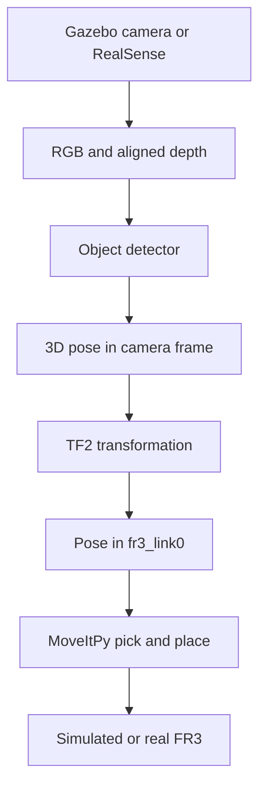
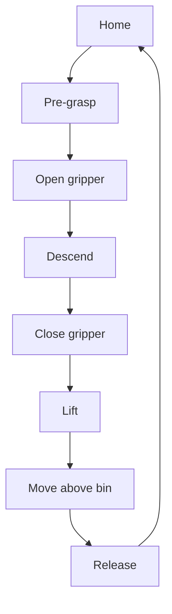

# FR3 Vision-Guided Sorting Cell

A step-by-step ROS 2 project for building a vision-guided sorting cell with a **Franka Research 3 (FR3)**, **MoveItPy**, **Gazebo**, and an **Intel RealSense RGB-D camera**.

> **Docker users:** Follow the [step-by-step Docker setup tutorial](DOCKER_SETUP.md) to build the ROS 2 Jazzy, MoveIt, Gazebo and RealSense environment.

The finished system observes three objects on a table, identifies each object, calculates its 3D position, transforms that position into the robot base frame, and commands the FR3 to place the object into the corresponding container.

> This project should be completed in simulation before connecting to the real robot. Start with simple color-based OpenCV detection. Add YOLO only after the complete RGB-D and robot-control pipeline works reliably.

## Project goals

You will learn how to:

- use the official Franka FR3 URDF/Xacro model;
- control the FR3 through MoveItPy;
- build a collision-aware planning scene;
- simulate a table, objects, containers, and an RGB-D camera in Gazebo;
- detect objects using OpenCV or YOLO;
- calculate a 3D point from a color pixel and depth image;
- transform an object pose with ROS 2 TF2;
- perform eye-to-hand camera calibration;
- transfer the pipeline from simulation to a real FR3;
- measure positioning error, grasp success rate, and cycle time.

## System overview



## Recommended environment

- Ubuntu 24.04
- ROS 2 Jazzy
- Gazebo Harmonic
- Franka Research 3
- `franka_description`
- `franka_ros2`
- `franka_fr3_moveit_config`
- MoveIt 2 / MoveItPy
- RealSense ROS 2 wrapper
- OpenCV and `cv_bridge`

The official Franka documentation supports the FR3 and provides packages for the robot description, ROS 2 control, MoveIt, gripper control, and Gazebo simulation.

## Repository structure

```text
fr3_vision_sorting/
├── config/
│   ├── objects.yaml
│   ├── sorting_bins.yaml
│   └── moveit_py.yaml
├── launch/
│   ├── simulation.launch.py
│   ├── vision.launch.py
│   └── real_robot.launch.py
├── models/
│   ├── red_cube/
│   ├── green_cylinder/
│   └── blue_box/
├── urdf/
│   └── sorting_cell.urdf.xacro
├── worlds/
│   └── sorting_world.sdf
├── fr3_vision_sorting/
│   ├── color_detector.py
│   ├── depth_to_point.py
│   ├── object_pose_transformer.py
│   ├── planning_scene_node.py
│   ├── pick_place_node.py
│   └── metrics_logger.py
├── package.xml
├── resource/
├── setup.cfg
└── setup.py
```

## Development roadmap

| Stage | Task | Completion test |
|---:|---|---|
| 1 | Visualize official FR3 model | FR3, joints, gripper, and TF tree appear correctly |
| 2 | Start MoveIt fake hardware | A pose goal can be planned and executed |
| 3 | Pick and place using fixed coordinates | Ten consecutive successful cycles |
| 4 | Add the planning scene | Plans do not pass through the table or bins |
| 5 | Start Gazebo FR3 | Joint states and controllers are available |
| 6 | Add simulated RGB-D camera | RGB, depth, camera info, and TF are valid |
| 7 | Detect three objects | Stable class and center-pixel output |
| 8 | Calculate the 3D position | Correct pose in the camera optical frame |
| 9 | Transform the pose with TF2 | RViz marker appears on the object |
| 10 | Complete simulated sorting | Thirty consecutive sorting trials |
| 11 | Calibrate the RealSense | Mean position error below 10 mm |
| 12 | Test the real FR3 at low speed | One safe object-transfer cycle |

---

## 1. Create the ROS 2 package

```bash
mkdir -p ~/franka_ros2_ws/src
cd ~/franka_ros2_ws/src

ros2 pkg create fr3_vision_sorting \
  --build-type ament_python \
  --dependencies \
  rclpy \
  geometry_msgs \
  sensor_msgs \
  visualization_msgs \
  moveit_msgs \
  shape_msgs \
  tf2_ros \
  tf2_geometry_msgs \
  cv_bridge
```

Create the project directories:

```bash
cd ~/franka_ros2_ws/src/fr3_vision_sorting
mkdir -p config launch models urdf worlds
```

Install useful dependencies:

```bash
sudo apt update
sudo apt install -y \
  ros-jazzy-cv-bridge \
  ros-jazzy-image-transport \
  ros-jazzy-tf2-tools \
  ros-jazzy-tf2-geometry-msgs \
  ros-jazzy-realsense2-camera \
  python3-opencv
```

Build the workspace:

```bash
cd ~/franka_ros2_ws
rosdep install --from-paths src --ignore-src -r -y
colcon build --symlink-install
source install/setup.bash
```

## 2. Verify the official FR3 description

Do not copy or modify the official Franka URDF. Keep it as a dependency and add the table, camera, and objects through your own package.

Check that the official packages are installed:

```bash
source /opt/ros/jazzy/setup.bash
source ~/franka_ros2_ws/install/setup.bash

ros2 pkg prefix franka_description
ros2 pkg prefix franka_fr3_moveit_config
ros2 pkg prefix franka_gazebo_bringup
```

Inspect the installed FR3 model files:

```bash
FRANKA_PATH=$(ros2 pkg prefix franka_description)
find "$FRANKA_PATH/share/franka_description/robots" -maxdepth 3 -type f
```

Visualize the model:

```bash
ros2 launch franka_description visualize_franka_robot.launch.py \
  robot_type:=fr3 \
  robot_ee:=franka_hand
```

If your installed version uses different launch arguments, check them instead of guessing:

```bash
ros2 launch franka_description visualize_franka_robot.launch.py --show-args
```

Verify the model:

```bash
ros2 topic echo /joint_states --once
ros2 topic echo /robot_description --once
ros2 run tf2_tools view_frames
```

## 3. Start MoveIt with fake hardware

Start with fake hardware before Gazebo or the real robot:

```bash
ros2 launch franka_fr3_moveit_config moveit.launch.py \
  robot_ip:=dont-care \
  use_fake_hardware:=true
```

Check the installed launch arguments if necessary:

```bash
ros2 launch franka_fr3_moveit_config moveit.launch.py --show-args
```

Verify the controllers and planning scene:

```bash
ros2 control list_controllers
ros2 action list | grep trajectory
ros2 topic list | grep planning_scene
ros2 topic echo /joint_states --once
```

Verify the actual base and tool frames:

```bash
ros2 run tf2_ros tf2_echo fr3_link0 fr3_hand_tcp
```

Do not blindly copy old Panda tutorials. This project should use the names from the installed FR3 configuration, normally:

```text
Planning group: fr3_arm
Base frame:     fr3_link0
Tool frame:     fr3_hand_tcp
Controller:     fr3_arm_controller
```

## 4. Complete fixed-coordinate pick and place

Before using a camera, command the robot using a known object position:

```text
Object position in fr3_link0: [0.45, 0.10, 0.03] m
```

Use this state machine:



Recommended heights:

```python
pre_grasp_z = object_z + 0.15
grasp_z = object_z + 0.04
lift_z = object_z + 0.20
```

The basic MoveItPy pose-goal pattern is:

```python
from geometry_msgs.msg import PoseStamped
from moveit.planning import MoveItPy

robot = MoveItPy(node_name="fr3_sorting_moveit")
arm = robot.get_planning_component("fr3_arm")

goal = PoseStamped()
goal.header.frame_id = "fr3_link0"
goal.pose.position.x = 0.45
goal.pose.position.y = 0.10
goal.pose.position.z = 0.18

# Replace this with a downward-facing orientation already verified in RViz.
goal.pose.orientation.x = 1.0
goal.pose.orientation.y = 0.0
goal.pose.orientation.z = 0.0
goal.pose.orientation.w = 0.0

arm.set_start_state_to_current_state()
arm.set_goal_state(
    pose_stamped_msg=goal,
    pose_link="fr3_hand_tcp",
)

plan_result = arm.plan()

if plan_result:
    robot.execute(plan_result.trajectory, controllers=[])
else:
    raise RuntimeError("Motion planning failed")
```

MoveIt APIs vary slightly across versions. Preserve the execution function from your already working `cartesian_move.py` if its call signature differs.

### Stage test

Do not add vision until the robot can:

1. move home;
2. move 15 cm above the object;
3. descend vertically;
4. close the gripper;
5. lift the object;
6. move above a bin;
7. release it;
8. return home;
9. repeat ten times without `GOAL_STATE_INVALID`.

## 5. Add the table and bins to the Planning Scene

MoveIt must know the locations of the table, camera stand, bins, and objects. Otherwise, a mathematically valid trajectory may pass through them.

Example table collision object:

```python
from geometry_msgs.msg import Pose
from moveit_msgs.msg import CollisionObject
from shape_msgs.msg import SolidPrimitive

table = CollisionObject()
table.header.frame_id = "fr3_link0"
table.id = "table"

shape = SolidPrimitive()
shape.type = SolidPrimitive.BOX
shape.dimensions = [1.0, 0.8, 0.05]

pose = Pose()
pose.position.x = 0.45
pose.position.y = 0.0
pose.position.z = -0.025
pose.orientation.w = 1.0

table.primitives.append(shape)
table.primitive_poses.append(pose)
table.operation = CollisionObject.ADD
```

When an object is grasped:

1. remove it from the world collision objects;
2. attach it to `fr3_hand_tcp`;
3. carry it to the bin;
4. detach it;
5. add it back at the new location.

## 6. Start the official Gazebo integration

`franka_description` provides the robot model, but a URDF alone is not a complete simulation. Gazebo also needs `ros2_control`, controllers, a simulation hardware plugin, and a world.

Use the official `franka_gazebo_bringup` package as the robot-control base. Inspect its installed launch files:

```bash
GAZEBO_PATH=$(ros2 pkg prefix franka_gazebo_bringup)
find "$GAZEBO_PATH/share/franka_gazebo_bringup/launch" -type f
```

Before running a launch file, inspect its arguments:

```bash
ros2 launch franka_gazebo_bringup <launch_file>.launch.py --show-args
```

After launching, verify:

```bash
ros2 control list_controllers
ros2 topic echo /joint_states --once
ros2 topic list | grep -E "camera|image|depth"
```

Create `worlds/sorting_world.sdf` containing:

- a table;
- three colored objects;
- three destination bins;
- a fixed overhead RGB-D camera;
- sufficient lighting;
- the FR3 positioned beside the table.

Start with these classes:

| Class | Object | Destination |
|---|---|---|
| `red_cube` | Red cube | Left bin |
| `green_cylinder` | Green cylinder | Center bin |
| `blue_box` | Blue rectangular box | Right bin |

## 7. Add a fixed RGB-D camera

Start with an eye-to-hand configuration: the camera is fixed above the table and does not move with the robot.

Required topics:

```text
/camera/color/image_raw
/camera/aligned_depth_to_color/image_raw
/camera/color/camera_info
/camera/depth/color/points
```

Required TF chain:

```text
fr3_link0
└── camera_link
    └── camera_color_optical_frame
```

In simulation, the transform is known from the model. For an early TF-only test, publish an example static transform:

```bash
ros2 run tf2_ros static_transform_publisher \
  --x 0.60 --y 0.00 --z 1.00 \
  --roll 0.0 --pitch 3.14159 --yaw 0.0 \
  --frame-id fr3_link0 \
  --child-frame-id camera_link
```

Replace the example pose with the camera's actual Gazebo pose. Verify it:

```bash
ros2 run tf2_ros tf2_echo fr3_link0 camera_color_optical_frame
```

## 8. Detect the objects with OpenCV

Use color segmentation before YOLO:

```text
RGB image
  → convert BGR to HSV
  → apply a color mask
  → morphological opening/closing
  → find contours
  → reject small contours
  → calculate center pixel (u, v)
```

The detector should publish at least:

```text
class_name: red_cube
pixel_u: 328
pixel_v: 241
confidence: 0.98
```

Only accept a detection when:

```python
confidence > 0.80
contour_area > minimum_area
depth_is_valid is True
```

Once the complete project works, the detector can be replaced with YOLO while keeping the downstream 3D, TF, and MoveIt nodes unchanged.

## 9. Convert the depth pixel to a 3D point

For center pixel `(u, v)`, read aligned depth `Z` and camera intrinsics from `CameraInfo`:

```math
X = \frac{(u-c_x)Z}{f_x}
```

```math
Y = \frac{(v-c_y)Z}{f_y}
```

```math
Z = Z
```

Do not trust one depth pixel. Use the median of a small valid region:

```python
roi = depth_image[v-3:v+4, u-3:u+4]
valid = roi[(roi > 0) & np.isfinite(roi)]

if len(valid) == 0:
    raise RuntimeError("No valid depth around the object center")

z = float(np.median(valid))
```

Publish the result as:

```text
Topic:    /object_pose_camera
Type:     geometry_msgs/PoseStamped
frame_id: camera_color_optical_frame
```

Make sure the depth unit is converted to metres.

## 10. Transform the object pose with TF2

Transform the pose from the camera optical frame into the robot base frame:

```python
transform = tf_buffer.lookup_transform(
    "fr3_link0",
    object_camera.header.frame_id,
    rclpy.time.Time(),
)

object_base = tf2_geometry_msgs.do_transform_pose_stamped(
    object_camera,
    transform,
)
```

Publish:

```text
Topic:    /object_pose_base
Type:     geometry_msgs/PoseStamped
frame_id: fr3_link0
```

Display this pose as a marker in RViz. The marker must sit on the detected object before the pose is sent to MoveIt.

If it does not, check:

- depth units;
- aligned depth versus raw depth;
- camera optical-frame direction;
- the camera-to-base transform;
- RGB/depth timestamps;
- whether `(u, v)` lies inside the image.

## 11. Connect perception to pick and place

Replace the hard-coded coordinates in `pick_place_node.py` with `/object_pose_base`.

For each accepted detection:

1. freeze the selected object pose;
2. reject stale poses;
3. verify the pose is inside the allowed workspace;
4. calculate pre-grasp, grasp, and lift poses;
5. choose a destination bin from the class name;
6. plan the pre-grasp motion;
7. descend vertically;
8. close the gripper;
9. attach the collision object;
10. lift and move to the selected bin;
11. release and detach;
12. record the result.

Example workspace safety check:

```python
def pose_is_safe(pose):
    p = pose.pose.position
    return (
        0.25 <= p.x <= 0.70
        and -0.40 <= p.y <= 0.40
        and 0.00 <= p.z <= 0.35
    )
```

Never execute a visual target that fails this check.

## 12. Start the RealSense camera

For the real system:

```bash
ros2 launch realsense2_camera rs_launch.py \
  align_depth.enable:=true \
  pointcloud.enable:=true \
  enable_sync:=true
```

Check the streams:

```bash
ros2 topic list | grep camera
ros2 topic hz /camera/camera/color/image_raw
ros2 topic hz /camera/camera/aligned_depth_to_color/image_raw
ros2 topic echo /camera/camera/color/camera_info --once
```

The current ROS 2 wrapper uses parameters such as `align_depth.enable` and `pointcloud.enable`. Be careful with older tutorials that use legacy names.

## 13. Perform eye-to-hand calibration

For a fixed camera, estimate:

```math
{}^{base}T_{camera}
```

Recommended procedure:

1. print an AprilTag or ChArUco calibration target;
2. rigidly attach it to the FR3 end effector;
3. move the arm to 15–25 varied poses;
4. record `fr3_link0 → fr3_hand_tcp` at every pose;
5. detect `camera → calibration_target` at every pose;
6. solve the hand-eye calibration;
7. save the transform in a YAML file;
8. publish the calibrated transform at launch;
9. validate it using targets at independently measured positions.

Position error is:

```math
e = \sqrt{(x_m-x_g)^2 + (y_m-y_g)^2 + (z_m-z_g)^2}
```

Recommended target before real grasping:

```text
Mean position error:    < 10 mm
Maximum position error: < 20 mm
```

## 14. Transfer to the real FR3

Before commanding the real robot:

- complete at least 30 successful simulation cycles;
- add all known obstacles to the planning scene;
- set velocity and acceleration scaling to 0.10 or lower;
- impose a strict Cartesian workspace boundary;
- begin without grasping an object;
- keep the enable device and emergency stop accessible;
- confirm Desk execution mode and FCI state;
- keep people outside the robot workspace.

Use this real-robot test sequence:

```text
Test 1: HOME → PRE_GRASP → HOME
Test 2: HOME → PRE_GRASP → descend 5 cm → retreat → HOME
Test 3: open and close the gripper without an object
Test 4: grasp one lightweight object at low speed
Test 5: complete one sorting cycle
```

Do not begin with continuous three-object sorting.

## 15. Record performance

Save one CSV row for every trial:

```csv
trial_id,class,predicted_x,predicted_y,predicted_z,ground_truth_x,ground_truth_y,ground_truth_z,position_error_mm,grasp_success,cycle_time_s,failure_reason
1,red_cube,0.451,0.098,0.031,0.450,0.100,0.030,2.45,true,11.8,
```

Report:

```math
\text{Grasp success rate} = \frac{\text{successful grasps}}{\text{total attempts}} \times 100\%
```

Also report:

- mean and maximum 3D position error;
- mean cycle time;
- failure count by cause;
- success rate for each object class;
- planning failure rate;
- detection failure rate.

Suggested final targets:

| Metric | Target |
|---|---:|
| Mean 3D localization error | Below 10 mm |
| Grasp success rate | Above 90% |
| Mean cycle time | Below 15 s |
| Unsafe target executions | 0 |

## Suggested terminal layout

Use separate terminals so that each subsystem can be diagnosed independently.

### Terminal 1 — Robot and MoveIt

```bash
source ~/franka_ros2_ws/install/setup.bash
ros2 launch franka_fr3_moveit_config moveit.launch.py \
  robot_ip:=dont-care \
  use_fake_hardware:=true
```

### Terminal 2 — Camera

```bash
source ~/franka_ros2_ws/install/setup.bash
ros2 launch realsense2_camera rs_launch.py \
  align_depth.enable:=true \
  pointcloud.enable:=true
```

### Terminal 3 — Vision

```bash
source ~/franka_ros2_ws/install/setup.bash
ros2 launch fr3_vision_sorting vision.launch.py
```

### Terminal 4 — Pick and place

```bash
source ~/franka_ros2_ws/install/setup.bash
ros2 launch fr3_vision_sorting pick_place.launch.py
```

### Terminal 5 — Debugging

```bash
source ~/franka_ros2_ws/install/setup.bash
ros2 topic echo /object_pose_camera
ros2 topic echo /object_pose_base
ros2 run tf2_ros tf2_echo fr3_link0 camera_color_optical_frame
```

## Common problems

### `GOAL_STATE_INVALID`

Possible causes:

- unreachable target;
- incorrect tool orientation;
- target inside the table;
- incorrect end-effector link;
- stale joint state;
- collision with a bin or camera stand.

First move only to the pre-grasp pose and inspect the requested pose in RViz.

### Object pose is several centimetres away

Check:

- depth scale;
- RGB-depth alignment;
- camera intrinsics;
- optical-frame convention;
- camera calibration;
- TF direction;
- object-center pixel selection.

### Robot moves to a mirrored position

This usually indicates a frame-convention error. A ROS optical frame normally uses:

```text
+X: image right
+Y: image down
+Z: forward from camera
```

Do not treat the optical frame as a normal robot link frame.

### The arm can move but the gripper does not

The arm trajectory controller and gripper actions are separate. Check:

```bash
ros2 action list | grep gripper
ros2 control list_controllers
```

### The simulated object does not move with the gripper

Closing the visual gripper does not automatically create a physical grasp. Depending on the simulator, use a grasp/contact plugin or attach the object logically during early development.

## Recommended learning order

1. FR3 URDF, joints, and TF tree
2. MoveIt pose planning
3. Gripper actions
4. Planning Scene and collision objects
5. Gazebo RGB-D camera
6. OpenCV color segmentation
7. Camera intrinsics and depth projection
8. TF2 pose transformation
9. Eye-to-hand calibration
10. Vision-guided pick and place
11. YOLO or instance segmentation
12. Real-robot safety and performance testing

## Official references

- [Franka Control Interface documentation](https://frankarobotics.github.io/docs/)
- [Official Franka robot descriptions](https://github.com/frankarobotics/franka_description)
- [Official Franka ROS 2 integration](https://github.com/frankarobotics/franka_ros2)
- [MoveIt 2 documentation](https://moveit.picknik.ai/)
- [MoveItPy motion-planning tutorial](https://moveit.picknik.ai/main/doc/examples/motion_planning_python_api/motion_planning_python_api_tutorial.html)
- [MoveIt Planning Scene tutorial](https://moveit.picknik.ai/main/doc/concepts/planning_scene_monitor.html)
- [RealSense ROS 2 wrapper](https://github.com/realsenseai/realsense-ros)

## Final deliverable

A successful project demonstration should show:

1. three objects placed randomly on the table;
2. RGB-D perception detecting and locating each object;
3. object poses displayed correctly in RViz;
4. collision-aware FR3 motion planning;
5. each object placed into the correct container;
6. automatic recording of position error, grasp success, and cycle time;
7. a comparison between simulation and real-robot performance.

This project demonstrates a complete industrial robotics pipeline rather than only a computer-vision model: **sensing, calibration, coordinate transformation, planning, control, grasping, safety, and performance evaluation**.

