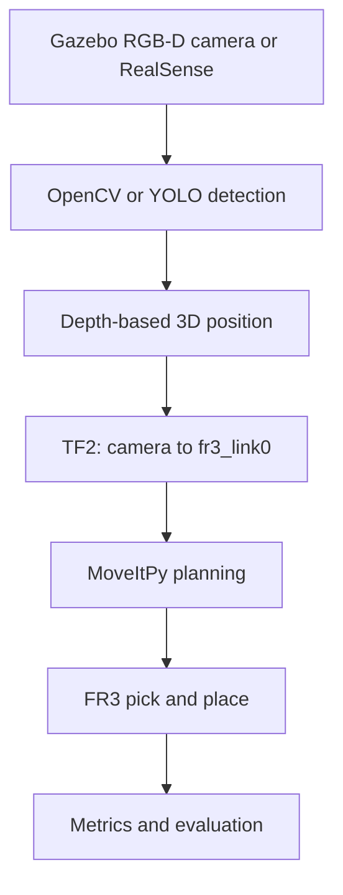

# FR3 Vision-Guided Sorting Cell


A step-by-step robotics experiment for building a **vision-guided sorting cell** with a **Franka Research 3 (FR3)**, **Intel RealSense RGB-D camera**, **ROS 2 Jazzy**, **MoveItPy**, **Gazebo Harmonic**, **OpenCV**, and **Docker**.

The target system detects red, green, and blue objects on a table, estimates each object's 3D position, transforms the position into the FR3 base frame, and uses collision-aware motion planning to place each object into the correct container.

> **Current status:** the Docker development environment and full implementation roadmap are available. The perception, calibration, simulation, and automatic sorting nodes will be added incrementally and validated one stage at a time.

## Quick start with Docker

Run the following commands in an **Ubuntu host terminal**:

```bash
cd ~

git clone https://github.com/ytang19-glitch/FR3-Vision-Guided-Sorting-Cell.git fr3_vision_sorting

cd ~/fr3_vision_sorting
```

The last argument in the `git clone` command creates a local folder named `fr3_vision_sorting`. It is a folder on your computer, not another folder shown inside the GitHub repository.

Then build and start the environment:

```bash
xhost +local:docker
docker compose build
docker compose up -d
docker exec -it fr3_vision_sorting bash
```

After entering the container, the repository is available at:

```text
/workspace
```

For the complete explanation, see [DOCKER_SETUP.md](DOCKER_SETUP.md).

## Project overview

This experiment connects the complete industrial robotics pipeline:



The first implementation uses simple colored objects because this makes every subsystem easy to inspect. After the complete pipeline works, OpenCV color detection can be replaced by YOLO or instance segmentation without changing the TF2 and MoveIt stages.

## Core features

- Official Franka FR3 URDF/Xacro model through `franka_description`.
- FR3 motion planning through MoveIt 2 and MoveItPy.
- Intel RealSense RGB, aligned depth, camera information, and point cloud.
- OpenCV HSV detection for red, green, and blue objects.
- Depth projection from image pixel `(u,v)` to camera-frame position `(X,Y,Z)`.
- TF2 transformation from `camera_color_optical_frame` to `fr3_link0`.
- Eye-to-hand calibration for a fixed overhead RealSense camera.
- Collision-aware table, object, camera stand, and sorting-bin representation.
- Gazebo simulation before transfer to the real FR3.
- Docker environment containing ROS 2 Jazzy, Gazebo, MoveIt, RealSense, and OpenCV.
- Experiment logging for localization error, grasp success rate, and cycle time.

**Keywords:** robotics, ROS 2, Franka Research 3, MoveItPy, Gazebo, RealSense, OpenCV, RGB-D perception, TF2, pick-and-place, Docker

## Current progress

| Stage | Status | Completion test |
|---|---|---|
| Docker environment | ✅ Added | Image definition, Compose configuration, USB and GUI setup |
| FR3 project roadmap | ✅ Added | Full simulation-to-real workflow documented |
| Relevant research papers | ✅ Added | Project-related papers collected |
| RealSense hardware detection | 🔄 Testing | Camera appears in `lsusb` and `rs-enumerate-devices` |
| RGB/depth ROS topics | ⬜ Planned | Color, aligned depth, CameraInfo and point cloud available |
| Fixed-coordinate MoveIt grasp | ⬜ Planned | Ten successful simulated cycles |
| OpenCV object detection | ⬜ Planned | Stable class and center-pixel output |
| 3D localization and TF2 | ⬜ Planned | RViz marker appears on the physical object |
| Gazebo sorting cell | ⬜ Planned | Thirty successful simulated sorting cycles |
| RealSense hand-eye calibration | ⬜ Planned | Mean localization error below 10 mm |
| Real FR3 sorting | ⬜ Planned | Safe low-speed sorting of three objects |

## Repository structure

```text
FR3-Vision-Guided-Sorting-Cell/
├── Dockerfile                  # ROS 2 Jazzy development image
├── compose.yaml                # USB, GUI, network and workspace configuration
├── start_container.sh          # Automatically sources ROS environments
├── .dockerignore               # Excludes generated files from Docker builds
├── DOCKER_SETUP.md             # Build-your-own-Docker tutorial
├── README.md                   # Project overview and experiment workflow
├── Relevant_papers.md          # Papers related to vision-guided manipulation
└── ros2_ws/
    └── src/
        └── README.md           # ROS package creation command
```

The planned ROS package structure is:

```text
ros2_ws/src/fr3_vision_sorting/
├── config/
│   ├── objects.yaml
│   ├── sorting_bins.yaml
│   └── moveit_py.yaml
├── launch/
│   ├── simulation.launch.py
│   ├── vision.launch.py
│   └── real_robot.launch.py
├── models/
├── urdf/
│   └── sorting_cell.urdf.xacro
├── worlds/
│   └── sorting_world.sdf
├── fr3_vision_sorting/
│   ├── color_detector.py
│   ├── depth_to_point.py
│   ├── object_pose_transformer.py
│   ├── planning_scene_node.py
│   ├── pick_place_node.py
│   └── metrics_logger.py
├── package.xml
├── setup.cfg
└── setup.py
```

## Installation option A — Docker (recommended)

Docker gives every student the same ROS 2, MoveIt, Gazebo, RealSense, and OpenCV environment.

For the detailed explanation of every file and command, read:

> [Build Your Own Docker Environment](DOCKER_SETUP.md)

### 1. Clone the repository

```bash
cd ~
git clone https://github.com/ytang19-glitch/FR3-Vision-Guided-Sorting-Cell.git fr3_vision_sorting
cd ~/fr3_vision_sorting
```

### 2. Allow GUI applications

Run on the Ubuntu host:

```bash
xhost +local:docker
```

### 3. Build the image

```bash
docker compose build
```

The image name is:

```text
fr3-vision-sorting:jazzy
```

### 4. Start and enter the container

```bash
docker compose up -d
docker exec -it fr3_vision_sorting bash
```

The container name is:

```text
fr3_vision_sorting
```

### What the Docker image contains

| Component | Purpose |
|---|---|
| ROS 2 Jazzy Desktop | ROS nodes, tools, RViz and development environment |
| Gazebo / `ros_gz` | Robot and RGB-D sensor simulation |
| MoveIt 2 / MoveItPy | Motion planning and execution |
| RealSense ROS driver | RGB, depth, CameraInfo and point cloud |
| OpenCV / `cv_bridge` | Image processing and ROS image conversion |
| TF2 tools | Camera-to-robot coordinate transformation |
| Colcon / rosdep | ROS package dependency installation and building |

The Compose file mounts the repository into the container:

```text
Host:      ~/fr3_vision_sorting
Container: /workspace
```

Therefore, source code remains on the host even if the container is recreated.

## Installation option B — Native ROS 2

Use this method only when ROS 2 Jazzy and the required Franka packages are already installed directly on Ubuntu 24.04.

```bash
mkdir -p ~/franka_ros2_ws/src
cd ~/franka_ros2_ws/src

ros2 pkg create fr3_vision_sorting \
  --build-type ament_python \
  --dependencies \
  rclpy \
  geometry_msgs \
  sensor_msgs \
  visualization_msgs \
  moveit_msgs \
  shape_msgs \
  tf2_ros \
  tf2_geometry_msgs \
  cv_bridge
```

Install dependencies and build:

```bash
cd ~/franka_ros2_ws
rosdep install --from-paths src --ignore-src -r -y
colcon build --symlink-install
source install/setup.bash
```

## First experiment — Test the RealSense

Do not move the real FR3 in the first experiment. First verify the complete camera data path.

### 1. Check the camera on the Ubuntu host

```bash
watch -n 1 lsusb
```

Reconnect the RealSense and look for a new device. Then run:

```bash
lsusb | grep -Ei 'intel|realsense|8086'
rs-enumerate-devices
```

If the host cannot detect the camera, Docker cannot detect it.

### 2. Start the RealSense ROS node

Inside the container:

```bash
ros2 launch realsense2_camera rs_launch.py \
  align_depth.enable:=true \
  pointcloud.enable:=true \
  enable_sync:=true
```

### 3. Check the ROS topics

In a second terminal:

```bash
docker exec -it fr3_vision_sorting bash
ros2 topic list | grep camera
```

Expected topics include:

```text
/camera/camera/color/image_raw
/camera/camera/color/camera_info
/camera/camera/aligned_depth_to_color/image_raw
/camera/camera/depth/color/points
```

Check the stream rates:

```bash
ros2 topic hz /camera/camera/color/image_raw
ros2 topic hz /camera/camera/aligned_depth_to_color/image_raw
```

### 4. View RGB and point-cloud data

```bash
rqt_image_view
```

Select `/camera/camera/color/image_raw`.

For the point cloud:

```bash
rviz2
```

Set the Fixed Frame to `camera_link`, add a `PointCloud2` display, and select `/camera/camera/depth/color/points`.

### First-experiment success condition

```text
RealSense
  → ROS 2 RGB image
  → aligned depth image
  → 3D point cloud in RViz
```

## System workflow

1. The Gazebo RGB-D camera or physical RealSense publishes RGB, aligned depth, and camera calibration information.
2. `color_detector.py` identifies a red, green, or blue object and obtains its center pixel `(u,v)`.
3. `depth_to_point.py` reads depth `Z` and calculates the camera-frame position `(X,Y,Z)`.
4. `object_pose_transformer.py` uses TF2 to transform the pose into `fr3_link0`.
5. `planning_scene_node.py` adds the table, bins, objects, and camera stand as collision objects.
6. `pick_place_node.py` uses MoveItPy to execute pre-grasp, grasp, lift, transfer, release, and return motions.
7. `metrics_logger.py` records localization error, success, cycle time, and failure cause.

## Development process

### Stage 1 — Official FR3 description

- Use `franka_description` rather than copying or modifying the official model.
- Verify `fr3_link0`, `fr3_hand_tcp`, joint states, and the TF tree.
- Visualize the robot in RViz before adding the environment.

```bash
ros2 pkg prefix franka_description
ros2 run tf2_ros tf2_echo fr3_link0 fr3_hand_tcp
```

### Stage 2 — Fixed-coordinate motion

Before vision, command a known target pose:

```text
Object position in fr3_link0: [0.45, 0.10, 0.03] m
```

Complete:

```text
HOME → PRE_GRASP → OPEN → DESCEND → CLOSE
     → LIFT → MOVE_TO_BIN → RELEASE → HOME
```

Do not add vision until this sequence succeeds ten times.

### Stage 3 — Planning Scene

Add collision objects for:

- table;
- camera stand;
- sorting bins;
- detected object.

When the object is grasped, attach it to `fr3_hand_tcp`. Detach it after release.

### Stage 4 — Gazebo sorting cell

Create a simulation containing:

- official FR3 model;
- table;
- fixed overhead RGB-D camera;
- red cube;
- green cylinder;
- blue box;
- three destination containers.

### Stage 5 — OpenCV detection

Initial algorithm:

```text
RGB → HSV → color mask → morphology
    → contours → center pixel (u,v)
```

Use OpenCV before YOLO because it is easier to debug lighting, image topics, coordinates, and depth alignment.

### Stage 6 — Depth-based 3D position

For pixel `(u,v)`, depth `Z`, and camera intrinsics:

```math
X = \frac{(u-c_x)Z}{f_x}
```

```math
Y = \frac{(v-c_y)Z}{f_y}
```

Use the median depth from a small region rather than one pixel.

### Stage 7 — TF2 transformation

Transform:

```text
camera_color_optical_frame → fr3_link0
```

Display the result as an RViz marker. The marker must appear on the object before the pose is sent to MoveIt.

### Stage 8 — Eye-to-hand calibration

For the fixed overhead RealSense, estimate:

```math
{}^{base}T_{camera}
```

Use an AprilTag or ChArUco target and collect 15–25 varied robot poses. Validate on independently measured positions.

Target accuracy:

```text
Mean 3D error:    < 10 mm
Maximum 3D error: < 20 mm
```

### Stage 9 — Real FR3 transfer

Before the first real movement:

- complete at least 30 successful simulation cycles;
- set velocity and acceleration scaling to 0.10 or lower;
- enforce a Cartesian workspace boundary;
- add all fixed obstacles to the Planning Scene;
- keep the enable device and emergency stop accessible;
- begin with `HOME → PRE_GRASP → HOME`;
- do not begin with continuous sorting.

## Planned ROS package summary

| Module | Responsibility |
|---|---|
| `color_detector.py` | Detect object class and center pixel |
| `depth_to_point.py` | Convert aligned depth into camera-frame 3D position |
| `object_pose_transformer.py` | Transform the pose into `fr3_link0` |
| `planning_scene_node.py` | Maintain table, bins, objects and attachments |
| `pick_place_node.py` | Plan and execute the sorting sequence |
| `metrics_logger.py` | Record error, success rate and cycle time |
| Launch files | Start simulation, vision or the real-robot configuration |

## Key technologies

| Technology | Purpose |
|---|---|
| ROS 2 Jazzy | Nodes, topics, parameters, actions and system integration |
| Franka ROS 2 | FR3 description, hardware interface and controllers |
| Gazebo Harmonic | Robot, object, contact and RGB-D simulation |
| MoveIt 2 / MoveItPy | Collision-aware manipulation planning |
| Intel RealSense | Physical RGB-D perception |
| OpenCV | Initial color and contour detection |
| TF2 | Camera-to-robot coordinate transformation |
| Docker Compose | Reproducible environment, USB access and GUI configuration |
| Python 3.12 | Perception, planning orchestration and metrics |

## Experiment metrics

Save one row for every trial:

```csv
trial_id,class,predicted_x,predicted_y,predicted_z,ground_truth_x,ground_truth_y,ground_truth_z,position_error_mm,grasp_success,cycle_time_s,failure_reason
1,red_cube,0.451,0.098,0.031,0.450,0.100,0.030,2.45,true,11.8,
```

Final targets:

| Metric | Target |
|---|---:|
| Mean localization error | Below 10 mm |
| Grasp success rate | Above 90% |
| Mean cycle time | Below 15 s |
| Unsafe target executions | 0 |

## Troubleshooting

### RealSense does not appear

On the host:

```bash
watch -n 1 lsusb
sudo dmesg | tail -40
```

Try a USB 3 port and a known data cable.

### RealSense appears on host but not in Docker

```bash
docker inspect fr3_vision_sorting | grep -A5 /dev/bus/usb
docker compose down
docker compose up -d
```

### RViz or camera window does not open

Run on the host:

```bash
xhost +local:docker
echo "$DISPLAY"
```

Then recreate the container.

### MoveIt reports `GOAL_STATE_INVALID`

Check:

- target reachability;
- tool orientation;
- table collision;
- end-effector link;
- current joint state;
- camera stand and bin collisions.

Test only the pre-grasp pose first.

### The pose is mirrored or several centimetres away

Check:

- depth units;
- RGB-depth alignment;
- camera intrinsics;
- optical-frame convention;
- TF direction;
- hand-eye calibration;
- RGB/depth timestamps.

A ROS optical frame normally uses:

```text
+X: image right
+Y: image down
+Z: forward from camera
```

## Daily Docker workflow

```bash
cd ~/fr3_vision_sorting
xhost +local:docker
docker compose up -d
docker exec -it fr3_vision_sorting bash
```

Build the ROS workspace:

```bash
cd /workspace/ros2_ws
colcon build --symlink-install
source install/setup.bash
```

Stop:

```bash
exit
docker compose down
```

## Docker build versus ROS build

| Command | What it builds |
|---|---|
| `docker compose build` | Base operating environment and installed dependencies |
| `docker compose up -d` | Starts the development container |
| `colcon build --symlink-install` | ROS 2 packages inside `ros2_ws` |
| Editing Python files | Perception, TF, planning and experiment behavior |

Rebuild Docker after changing the `Dockerfile`. Use `colcon build` for ROS package changes.

## References

- [Detailed Docker tutorial](DOCKER_SETUP.md)
- [Relevant research papers](Relevant_papers.md)
- [Franka Control Interface documentation](https://frankarobotics.github.io/docs/)
- [Official Franka robot descriptions](https://github.com/frankarobotics/franka_description)
- [Official Franka ROS 2 integration](https://github.com/frankarobotics/franka_ros2)
- [MoveIt 2 documentation](https://moveit.picknik.ai/)
- [RealSense ROS 2 wrapper](https://github.com/realsenseai/realsense-ros)

## Safety

This repository is an educational and research project. Validate perception, transforms, collision geometry, and motion planning in simulation before using a physical robot. Begin real-robot tests at low speed with supervision and accessible safety controls.
