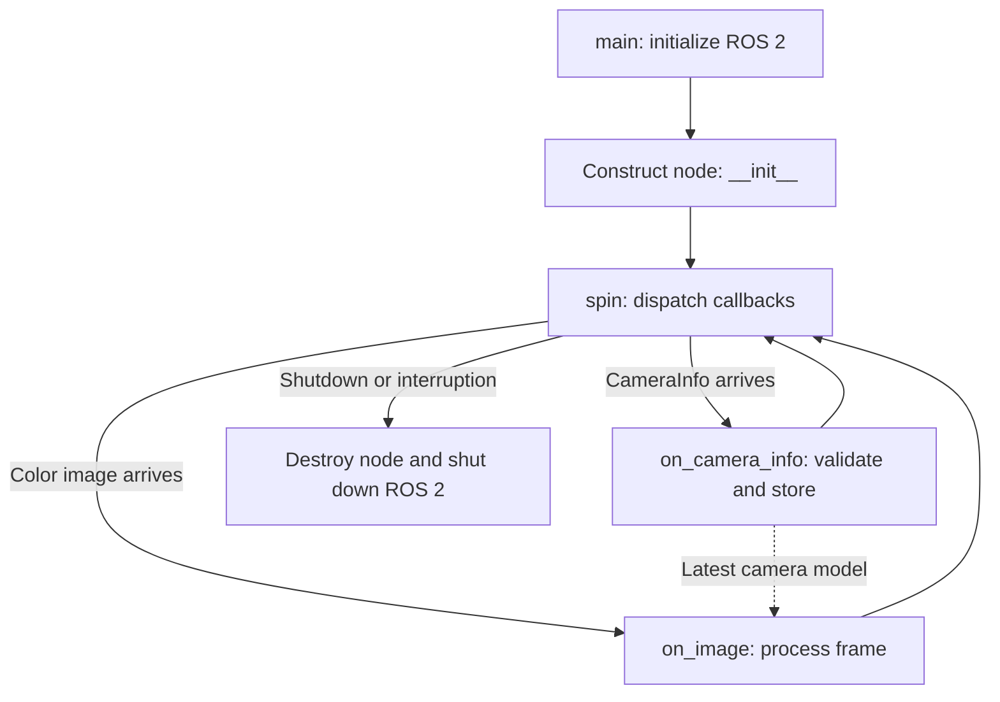
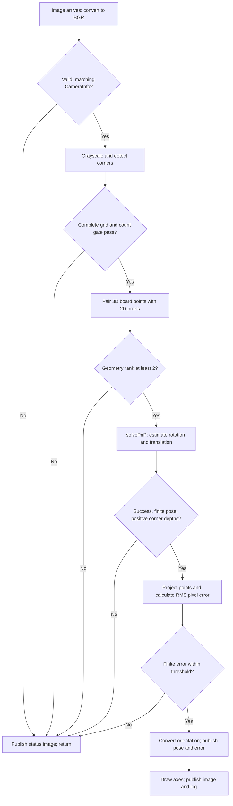

# Stage 6 — Camera-to-FR3 Calibration and TF2

## Objective and current confirmed setup

The Intel RealSense D405 is mounted on a fixed overhead support, separate from
the FR3. This is an **eye-to-hand** configuration.

Stage 5 has now been experimentally validated far enough to provide a live
camera-frame 3D target point. The current perception node successfully detects
the small **red marker/target** used in the experiment, reads aligned depth,
deprojects the detected pixel into camera-frame XYZ, and publishes:

```text
/object_point_camera
```

A representative successful result was:

```text
Red target detected: pixel=(388, 289), area≈390 px
Depth≈1.072 m
PUBLISHED /object_point_camera:
X≈-0.094 m
Y≈ 0.122 m
Z≈ 1.072 m
```

The message frame is:

```text
camera_color_optical_frame
```

Therefore the current pipeline is:

```text
RealSense RGB
    ↓
red-target detection
    ↓
center pixel (u, v)
    ↓
aligned depth Z
    ↓
camera intrinsics
    ↓
P_camera = [Xc, Yc, Zc]
    ↓
/object_point_camera
```

Stage 6 must build the bridge from this camera-frame point to the FR3 base
frame:

```text
P_camera
    ↓
T_base_camera
    ↓
P_base
    ↓
/object_point_base
```

Only after this transform is calibrated and validated should the detected point
be used to generate robot pickup poses.

Calibration **estimates** the fixed camera pose relative to the robot. TF2 then
**stores and applies** that transform. TF2 does not discover the calibration by
itself.

---

## Current board — plain checkerboard

Updated 2026-09-09: the active detector now uses a **plain checkerboard**.
The earlier ChArUco/ArUco marker workflow is historical and is no longer the
procedure for this board.

| Setting | Current configuration |
|---|---|
| Printed squares | 10 × 7 |
| Internal corners expected by OpenCV | 9 × 6 = **54** |
| Square side reported for the current board | **25 mm = 0.025 m**; verify against the physical print |
| Uploaded script default | 20 mm; override with `square_side:=0.025` for the 25 mm board |
| Marker size / dictionary | Not used |
| Pose output | `/calibration_board/pose`, representing ${}^{c}T_{t}$ |
| Quality output | `/calibration_board/reprojection_error_px` |
| Visual output | `/calibration_board/annotated_image` |

The uploaded checkerboard implementation uses `findChessboardCornersSB` when
available, then falls back to `findChessboardCorners` and `cornerSubPix`.
It requires the **complete 54-corner grid**. Its default `min_corners=8`
does not enable partial-board detection because incomplete grids are rejected
earlier.

Keep all required intersections visible, sharp and well lit. Move the board
closer during detection tests if corners are too small to resolve; avoid
cropping it or introducing blur, glare or extreme tilt.

### Run and inspect the checkerboard detector

After the executable has been registered, the package built and the workspace
sourced, use:

```bash
ros2 run fr3_vision_sorting calibration_board_detector --ros-args -p square_side:=0.025
```

In separate terminals:

```bash
ros2 topic echo /calibration_board/pose
ros2 topic echo /calibration_board/reprojection_error_px
ros2 run rqt_image_view rqt_image_view
```

Select `/calibration_board/annotated_image` in the viewer. The target detection
count is `Corners: 54/54`. A pose is published only after geometry, positive
depth and reprojection checks pass; the default maximum error is 2.0 pixels.
This is the expected behavior of the uploaded source, not a claim that a live
camera run or camera-to-base calibration has already succeeded.

### What changed and what stays mathematically the same

The board model and corner detector replace the ChArUco-specific operations.
Pose estimation still pairs known 3D board points with detected 2D pixels:

```math
\mathbf{p}_{c} = {}^{c}R_{t}\,\mathbf{p}_{t} + {}^{c}\mathbf{t}_{t}
```

Here, $c$ denotes the camera frame and $t$ the checkerboard frame.

The detector uses color images and CameraInfo, **not depth pixels**, to estimate
board pose. It neither moves the FR3 nor computes ${}^{b}T_{c}$ by itself.

The first internal corner is modeled as `(s, s, 0)`, not `(0, 0, 0)`.
The origin is therefore one square before it along both board axes.
The generated indices 0–53 are detector-order indices, not persistent marker
IDs. Verify a consistent physical origin and axes across every calibration
sample; a plain checkerboard can have orientation ambiguity. This code does
not automatically resolve it.

A wrong square size scales the estimated translation even when reprojection
error is low. Modeling a true 25 mm pattern as 20 mm gives approximately
0.8 times the correct translation scale.

**Next milestone:** stable 54-corner detection, consistent board axes and
validated ${}^{c}T_{t}$. Then collect paired camera/robot observations
using the procedure below.

---

## Start here — eight-step practical walkthrough

This walkthrough explains what to do in the lab and what must work before each
next step. The detailed sections below contain the transform conventions and
implementation notes.

**Method used here:** the D405 remains fixed overhead, and the calibration
board is rigidly attached to the robot end effector. The board moves with the
robot. Calibration has not been completed merely because the red-target
detector works.

A board placed on the table uses a different procedure: its full pose relative
to `fr3_link0` must be independently established. Do not combine table-mounted
board measurements with the moving-board hand-eye procedure below.

### Step 1 — Verify cube detection and depth stability

Keep the camera driver running. In separate terminals, source the environment:

```bash
source /opt/ros/jazzy/setup.bash
source /workspace/ros2_ws/install/setup.bash
```

Run the localizer and leave it running:

```bash
ros2 run fr3_vision_sorting camera_object_localizer
```

Open the viewer in another terminal:

```bash
ros2 run rqt_image_view rqt_image_view
```

Select `/camera_object_localizer/annotated_image`. In another terminal, inspect:

```bash
ros2 topic echo /object_point_camera
```

With the robot stationary:

1. Move the cube by hand and confirm the outline follows it.
2. Remove or cover the separate red label if the detector selects it.
3. Leave the cube still for about ten seconds and record XYZ variation.
4. Remove the cube and confirm new valid cube points stop appearing.

The viewer and `topic echo` do not perform detection. Stopping the localizer
stops new annotated images and target points; a displayed old image or point
does not prove detection is still live.

**Checkpoint:** the intended cube is selected consistently, depth is valid,
and stationary variation is small enough for the intended grasp clearance.
Also verify absolute depth against a physical reference; stability alone does
not establish accuracy. Depth Z is the optical-axis coordinate, not generally
the straight-line distance from the camera origin.

Your raw color calibration has nonzero distortion coefficients. Before
precision localization, use distortion-aware deprojection with the matching
camera model. Aligning depth to color does not rectify the color image.

### Step 2 — Prepare a rigid, measured checkerboard

Use the current **10 × 7-square checkerboard**, with **9 × 6 internal corners**.
Measure several adjacent squares and divide by their count to verify the
reported 25 mm side. Set `square_side:=0.025` only when it matches the print.

Attach the pattern to flat rigid backing. For the moving-board calibration
procedure, mount it rigidly to the end effector with suitable clearance.
It must not slip relative to the selected tool frame.

| Record | Meaning |
|---|---|
| Board type | Plain checkerboard |
| Pattern dimensions | 10 × 7 squares; 9 × 6 internal corners |
| Square size | Measured printed side, in meters |
| Board origin and axes | Same physical reference in all samples |
| Tool attachment | Fixed relationship to the selected tool frame |

**Checkpoint:** dimensions match the detector, all 54 intersections can be
observed, the board is flat and the attachment is rigid.

Dependencies used by the uploaded detector include:

| Dependency | Purpose |
|---|---|
| `rclpy` | ROS node, subscriptions, publishers and parameters |
| `sensor_msgs` | Image and CameraInfo |
| `geometry_msgs` | PoseStamped |
| `cv_bridge` | ROS/OpenCV image conversion |
| `std_msgs` | Reprojection error message |
| `python3-numpy` | Array and matrix calculations |
| `python3-opencv` | Checkerboard detection and pose estimation |
| `python3-scipy` | Rotation-to-quaternion conversion |

### Step 3 — Detect the board's position and orientation

Use the checkerboard version of `calibration_board_detector.py` explained below.
The existing red-target localizer is not a board-pose detector.

The board detector must find ordered corners, associate them with known metric
board coordinates, and estimate ${}^{c}T_{t}$ using the matching color `K` and
distortion coefficients `D`. Draw the detected corners and board axes,
preserve the image timestamp, and report reprojection error.

Here, ${}^{c}T_{t}$ means **board coordinates expressed in the camera frame**.
Unlike a single centroid, a board pose contains both position and orientation.

#### Startup and callbacks



**Checkpoint:** axes stay attached to the same board origin while stationary,
and inconsistent corner ordering is excluded from the dataset. The current
node checks numerical and reprojection validity but does not automatically
resolve checkerboard orientation ambiguity. See the
[OpenCV calibration documentation](https://docs.opencv.org/4.x/d9/d0c/group__calib3d.html)
for corner detection and pose estimation.

### Step 4 — Record paired camera and robot poses

Check the chosen tool frame:

```bash
ros2 run tf2_ros tf2_echo fr3_link0 fr3_hand_tcp
```

Use the actual validated tool frame if your configuration differs.
This terminal display is a diagnostic, not a synchronized sample recorder.

| Notation | Meaning                                                               |
| -------- | --------------------------------------------------------------------- |
| `b`      | Robot base frame: `fr3_link0`                                         |
| `g`      | Tool/end-effector frame, such as `fr3_hand_tcp`                       |
| `b_T_g`  | Position and orientation of the tool frame relative to the robot base |

For every sample, save:

| Measurement | Meaning |
|---|---|
| ${}^{c}T_{t}$ | Board pose observed by the camera |
| ${}^{b}T_{g}$ | Tool pose relative to `fr3_link0` at the image timestamp |
| Quality and timestamp | Evidence that the pair is usable |

Use your established supervised robot controls to move to a collision-checked
pose, stop, wait for settling, and trigger a sample save. The recorder should
look up robot TF at the image timestamp.

Start with approximately 15–25 useful pose pairs, including different
positions and tilts about multiple axes. Keep the board visible. Reserve
additional poses for validation. This sample count is a starting point, not a
guarantee; nearly identical orientations give little calibration information.

**Checkpoint:** each sample contains a synchronized pair, and the dataset has
meaningful rotational diversity.

### Step 5 — Calculate and validate the camera-to-base transform

Use a solver configured for the fixed-camera, moving-board geometry.
Let $b$ be robot base, $c$ camera, $g$ tool, and $t$ board.
The notation ${}^{a}T_{b}$ transforms coordinates from frame $b$ into frame $a$.
For sample $i$, the two paths from the board to the robot base must agree:
board → tool → base, and board → camera → base.

Every paired sample must satisfy:

```math
{}^{b}T_{g}(i)\,{}^{g}T_{t} = {}^{b}T_{c}\,{}^{c}T_{t}(i)
```

Here ${}^{b}T_{g}(i)$ and ${}^{c}T_{t}(i)$ are measured; ${}^{b}T_{c}$ and the rigid
mounting transform ${}^{g}T_{t}$ are fixed unknowns unless the mounting pose is
independently known. This guide does not supply or verify a solver executable.
Do not feed these poses into an eye-in-hand API without checking its frame
conventions.

For a table-mounted board with independently measured full pose ${}^{b}T_{t}$,
the alternative relation is:

```math
{}^{b}T_{c} = {}^{b}T_{t}\left({}^{c}T_{t}\right)^{-1}
```

Use the same physical board origin and axes in both measurements.

The result converts a camera point into a base point:

```math
\mathbf p_b = {}^bR_c\mathbf p_c + {}^bt_c
```

| Variable | Practical meaning |
|---|---|
| `p_c = [Xc, Yc, Zc]` | Detected point relative to the camera optical frame, in metres |
| ${}^{b}R_{c}$ | Rotation expressing the camera axes in the base frame |
| ${}^{b}\mathbf{t}_{c}$ | Camera optical origin's position relative to the base, in metres |
| `p_b = [Xb, Yb, Zb]` | The same physical point relative to `fr3_link0`, in metres |

Check physical plausibility and the reserved validation poses. The estimated
board-to-tool mounting transform should remain consistent because its
attachment is rigid. Save the result and validation errors.

**Checkpoint:** the measured transform passes validation. Do not substitute
guessed translations or quaternions.

### Step 6 — Connect the result to the existing TF tree

Inspect the RealSense TF tree, identify its actual root frame, and calculate
the base-to-root transform from the calibrated base-to-optical transform.
If $r$ is the actual RealSense root and the driver provides ${}^{r}T_{c}$, use:

```math
{}^{b}T_{r} = {}^{b}T_{c}\left({}^{r}T_{c}\right)^{-1}
```

Publish that fixed relationship while preserving the driver's internal transforms.

Do not give the optical frame a second parent.

Check:

```bash
ros2 run tf2_ros tf2_echo fr3_link0 camera_color_optical_frame
```

**Checkpoint:** TF resolves the relationship, its composed transform matches
the calibration, and it remains fixed as the robot moves. Moving the camera
or its support invalidates this calibration.

### Step 7 — Publish and verify /object_point_base

Implement `object_tf_transformer.py` with this behavior:

- Subscribe to `/object_point_camera`.
- Transform the actual coordinates into `fr3_link0` at the measurement timestamp.
- Reject stale/nonfinite points and unavailable transforms.
- Publish `/object_point_base`.

These are implementation tasks; this guide does not establish that the new
node already exists or is installed.

Once implemented and running:

```bash
ros2 topic echo /object_point_base
```

The output frame should be `fr3_link0`. Set the RViz fixed frame to
`fr3_link0` and display the point. Compare several locations against
independent physical references, using the same physical surface point for
both measurements.

**Checkpoint:** measured position errors and stationary variation satisfy the
task's grasp clearance across the intended pickup area. A plausible RViz
picture alone is insufficient.

### Step 8 — Test PRE_GRASP, then one supervised cycle

Convert the detected surface point into a grasp TCP pose using object
dimensions, marker location, finger geometry, the chosen TCP, and the verified
grasp orientation.

1. Generate PRE_GRASP above the intended grasp TCP pose.
2. Inspect the collision-checked plan in RViz.
3. Execute only the supervised approach and stop above the cube.
4. Verify alignment and clearance at several pickup locations.
5. Add a planned descent, close the gripper, and verify the object is held.
6. Lift and use saved PRE_BIN, BIN, and POST_BIN poses for placement.

A pair of endpoints does not guarantee a straight vertical trajectory.
Validate the actual approach and retreat paths.

Dynamic pickup requires pose-based planning; new detected XYZ values do not
modify saved joint poses automatically. Keep the labeled destination fixed
for this first experiment.

**Checkpoint:** complete one supervised cycle with a fresh validated
detection, correct alignment, confirmed grasp, and successful release.

### What to do in the next lab session

Complete Steps 1 and 2 first. Record the stationary target variation and your
board type, pattern dimensions, and measured square size. Those measurements
are needed to configure and test the board detector in Step 3.

---

## 1. Why Stage 6 is required for vision-guided pick-and-place

The camera currently reports the target in its own optical frame:

```text
camera_color_optical_frame
```

For example:

```text
Xc = -0.094 m
Yc =  0.122 m
Zc =  1.072 m
```

These values tell us where the target is relative to the camera, not where it
is relative to the FR3 base.

The robot plans motion using frames such as:

```text
fr3_link0
```

Therefore the FR3 cannot directly use `/object_point_camera` as a Cartesian
pickup position.

The required relation is:

```math
\mathbf p_b = {}^bR_c\mathbf p_c + {}^bt_c
```

or, in homogeneous form,

```math
\begin{bmatrix}
\mathbf p_b\\
1
\end{bmatrix} = {}^bT_c
\begin{bmatrix}
\mathbf p_c\\
1
\end{bmatrix}
```

where:

- `b` = `fr3_link0`
- `c` = `camera_color_optical_frame`
- ${}^{b}T_{c}$ = fixed transform from camera coordinates into robot-base coordinates

This is the transform Stage 6 must determine.

---

## 2. What the current Stage 5 outputs are useful for

The current detector prints several quantities:

```text
pixel=(u, v)
contour area
depth
Xc, Yc, Zc
```

These quantities have different roles.

### 2.1 Pixel `(u, v)`

This is the target's 2D image position.

```text
u → horizontal image coordinate
v → vertical image coordinate
```

When the target moves:

| Target movement in image | Expected change |
|---|---|
| Move right | `u` increases and `Xc` increases |
| Move left | `u` decreases and `Xc` decreases |
| Move down | `v` increases and `Yc` increases |
| Move up | `v` decreases and `Yc` decreases |

These are useful perception-validation checks.

### 2.2 Depth

The D405 aligned-depth image supplies the target distance from the camera.

```text
move closer to camera  → Zc decreases
move farther from camera → Zc increases
```

The revised Stage 5 node prints depth explicitly so that detection problems and
depth problems can be separated during debugging.

### 2.3 Camera-frame XYZ

The final Stage 5 result is:

```text
P_camera = [Xc, Yc, Zc]
```

This is the important quantity passed into Stage 6.

The chain is:

```text
(u, v) + aligned depth + camera intrinsics
                ↓
          camera-frame XYZ
                ↓
         /object_point_camera
```

The next chain is:

```text
/object_point_camera
        ↓
validated T_base_camera
        ↓
/object_point_base
```

---

## 3. Re-verify Stage 5 before calibration

Before collecting calibration data, keep the FR3 stationary and verify the
perception pipeline.

Source ROS 2 and the workspace:

```bash
source /opt/ros/jazzy/setup.bash
source /workspace/ros2_ws/install/setup.bash
```

Start the RealSense D405:

```bash
ros2 launch realsense2_camera rs_launch.py \
  align_depth.enable:=true \
  enable_sync:=true \
  pointcloud.enable:=true
```

Run the revised localizer:

```bash
ros2 run fr3_vision_sorting camera_object_localizer
```

Inspect the output:

```bash
ros2 topic echo /object_point_camera
```

Confirm the publisher:

```bash
ros2 topic info /object_point_camera -v
```

Expected state:

```text
Type: geometry_msgs/msg/PointStamped
Publisher count: 1
```

The important distinction learned in Stage 5 is:

> `Publisher count: 1` means the publisher exists. It does **not** prove that
> the callback reaches `publish()` on every frame.

The revised detector now logs when the target is found, when depth is valid and
when `/object_point_camera` is actually published.

If `rqt_image_view` is available, inspect:

```text
/camera_object_localizer/annotated_image
```

Run it with:

```bash
ros2 run rqt_image_view rqt_image_view
```

If it is missing inside the container:

```bash
apt update
apt install -y ros-jazzy-rqt-image-view
```

Then source ROS again.

### Stage 5 validation before continuing

Move the target by hand while the camera remains fixed. Confirm detection
follows the intended object, measure stationary variation, and compare depth
against an independent physical reference.


---

## Checkerboard code tutorial — function tables and flowcharts

The following tables explain the uploaded checkerboard source. They document
its behavior without changing the detector calculations.

### Code 1. Functions you wrote

| Function | When it runs / input | What it does / output | Why it is needed |
|---|---|---|---|
| `main(args=None)` | Script starts, or an installed entry point calls it | Initializes ROS 2, constructs the node, calls `rclpy.spin`, and cleans up on exit | Keeps the program running so incoming messages can trigger callbacks |
| `__init__(self)` | Once, when the node is constructed | Sets parameters; creates the bridge, 54 board points, publishers and subscribers; logs configuration | Prepares the data and ROS connections that later callbacks use |
| `on_camera_info(self, msg)` | A `CameraInfo` message arrives | Checks distortion model, finite calibration values and positive focal lengths; stores valid information, otherwise clears it | Pose estimation needs the correct camera model |
| `detect_corners(self, gray, k, d)` | Called by `on_image` | Tries SB detection, then classic detection with subpixel refinement; returns all 54 corners and indices, or `None, None` | Finds image locations corresponding to the known board points |
| `publish_image(self, image, header, status)` | Called for normal output or a handled rejection | Adds status text, converts the image to a ROS message, copies its header and publishes it | Lets you see detection results and reasons for rejecting a frame |
| `on_image(self, msg)` | A color image arrives | Converts and checks the image, detects corners, estimates and validates pose, publishes accepted results | This is the main processing pipeline |

A **callback** is a function ROS calls when its subscribed message arrives. The file does not repeatedly execute every function from top to bottom. `__init__` runs once; `spin` then dispatches callbacks. CameraInfo and images arrive separately, and this code uses the latest stored valid CameraInfo; it does not timestamp-synchronize them.

The `if __name__ == "__main__": main()` block starts the program when the file is executed directly.

### Code 2. Startup and callbacks


### Code 3. What happens inside on_image

| Step | Code / operation | What it produces | Why |
|---|---|---|---|
| 1 | `imgmsg_to_cv2(..., "bgr8").copy()` | Editable color image | OpenCV processes image arrays; the copy can be annotated |
| 2 | Check `self.camera_info` | A valid stored camera model, or early return | No calibrated projection is possible without it |
| 3 | Compare image size and frame ID | Matching Image/CameraInfo, or early return | Prevents using a camera model for a different image geometry or frame |
| 4 | Convert `info.k` and `info.d` to arrays | Intrinsic matrix K and distortion coefficients d | Inputs for pose estimation and projection |
| 5 | `cv2.cvtColor` | Grayscale image | Corner detection uses intensity structure |
| 6 | `self.detect_corners` | 54 pixel locations and indices, or no detection | Establishes the observed board grid |
| 7 | Draw corners; check `min_corners` | Annotated detections or early return | Displays the result and gates pose estimation |
| 8 | Index `board_points`; reshape arrays | Matching 3D board points and 2D image points | Each known physical corner must match its observed pixel |
| 9 | Center points and check matrix rank | Rejects rank below 2 | Collinear points do not provide the planar grid geometry expected here |
| 10 | `cv2.solvePnP` | Success flag, rotation vector and translation vector | Estimates how the board is positioned relative to the camera |
| 11 | Check success and finite values | Numerically usable pose, or early return | Rejects failed or invalid results |
| 12 | `cv2.Rodrigues`; transform points | Rotation matrix and board corners in camera coordinates | Enables geometric validation |
| 13 | Check every camera Z is positive | Rejects points behind the camera | Enforces visibility in front of the camera |
| 14 | `cv2.projectPoints`; compute RMS error | Pixel error | Checks how well the estimated pose explains detected corners |
| 15 | Compare error with `max_error` | Accepted pose or early return | Filters poor image fits |
| 16 | `Rotation.from_matrix`, `as_quat`, `as_euler` | Quaternion for ROS; angles for display | Encodes orientation and makes it readable |
| 17 | Fill and publish `PoseStamped` and `Float32` | Board pose and accepted reprojection error | Makes results available to other ROS nodes |
| 18 | `drawFrameAxes`, `publish_image`, logger | Visual axes, status and terminal report | Helps inspect the result |

A `return` in a callback ends processing of **that frame**, not the entire node. The next image can be processed normally.

The `except` block catches the listed bridge, OpenCV, value and indexing errors and logs a warning. Those exception paths do not necessarily publish an annotated image.

### Code 4. Image-processing flowchart



Here the count gate normally passes only with **54/54 corners**. Although `min_corners` defaults to 8, `detect_corners` already rejects an incomplete grid. Lowering `min_corners` does not enable partial-board detection. A setting greater than 54 blocks all poses.

### Code 5. Important library functions

| Function / class | Use in this script | Why |
|---|---|---|
| `Node` | Base class of the detector | Supplies ROS parameters, publishers, subscriptions and logging |
| `declare_parameter / get_parameter` | Declare defaults and read configuration | Allows topic names, size and thresholds to be configured |
| `create_subscription` | Connects a topic to a callback | Receives camera messages |
| `create_publisher / publish` | Creates outputs and sends messages | Shares the results |
| `qos_profile_sensor_data` | Subscription quality-of-service profile | Configures reception of sensor streams |
| `CvBridge` | ROS Image ↔ OpenCV array conversion | Bridges ROS transport and image processing |
| `np.zeros / np.mgrid` | Builds a regular 3D board grid | Supplies known physical corner coordinates |
| `np.asarray / reshape / flatten` | Converts and arranges arrays | Gives calculations the required shapes and ordering |
| `np.isfinite` | Detects NaN or infinite values | Rejects invalid inputs/results |
| `findChessboardCornersSB` | First detection attempt, if available | Finds the checkerboard intersections |
| `findChessboardCorners` | Fallback detector | Provides another detection path |
| `cornerSubPix` | Refines classic-detector corners | Improves pixel-coordinate precision |
| `np.linalg.matrix_rank` | Checks the centered board geometry | Detects a degenerate arrangement |
| `solvePnP` | Fits pose to 3D–2D correspondences | Provides the board-to-camera transformation |
| `Rodrigues` | Converts rotation vector to matrix | Provides R for point transformation |
| `projectPoints` | Predicts corner pixel locations from pose | Enables reprojection validation |
| `Rotation.from_matrix / as_quat` | Converts R to quaternion | Matches the ROS orientation representation |
| `as_euler("xyz", degrees=True)` | Produces display angles | Makes orientation readable in logs |
| `drawChessboardCorners / drawFrameAxes / putText` | Adds visual overlays | Helps debug detection and pose |
| `destroy_node / shutdown` | Releases node and ROS resources | Clean program exit |

The `k` and `d` arguments to `detect_corners` are retained in its signature but are not used in its body. Raw-image corners are passed to pose estimation together with K and d.

### Code 6. Data and topic map

| Name | Meaning / shape | Units |
|---|---|---|
| `pattern_size` | (9, 6) internal intersections for 10 × 7 squares | Corner counts |
| `board_points` | 54 × 3 known corner coordinates | Meters in this script |
| `corners` | Detected corner array, reshaped into 54 × 2 | Pixels |
| `ids` | Indices 0–53 in detector order | Indices, not physical marker IDs |
| `k` | 3 × 3 intrinsic matrix containing fx, fy, cx, cy | Focal lengths and principal point in pixels |
| `d` | Lens-distortion coefficient vector | Camera-model coefficients |
| `rvec` | 3 × 1 rotation vector; not roll/pitch/yaw | Axis-angle rotation vector |
| `tvec` | 3 × 1 board-origin position in camera frame | Meters |
| `rotation_matrix` | 3 × 3 R | Dimensionless |
| `quaternion` | [x, y, z, w] orientation | Dimensionless |
| `error` | RMS distance between predicted and detected pixels | Pixels |

| ROS topic | Direction | Type | Purpose |
|---|---|---|---|
| `/camera/camera/color/image_raw` | Input | `Image` | Color image |
| `/camera/camera/color/camera_info` | Input | `CameraInfo` | Existing intrinsics and distortion model |
| `/calibration_board/pose` | Output | `PoseStamped` | Accepted board pose in the image's optical frame |
| `/calibration_board/annotated_image` | Output | `Image` | Status, detected corners and accepted-pose axes |
| `/calibration_board/reprojection_error_px` | Output | `Float32` | Error for accepted poses only |

The node does not subscribe to depth, calculate new camera intrinsics, broadcast TF, or send robot commands. A rejected frame publishes no new pose or error, so a downstream consumer must not assume an old pose is a fresh detection.


### Reading the pose correctly

`tvec` is the board origin expressed in camera coordinates, in the same
length units as the supplied board points. This script chooses meters; OpenCV
does not intrinsically require meters. `rvec` encodes axis-angle rotation,
not roll/pitch/yaw. These quantities describe the board-to-camera transform.
See [OpenCV's pose convention](https://docs.opencv.org/4.x/d5/d1f/calib3d_solvePnP.html).

The source comment calling `as_euler("xyz")` intrinsic is inaccurate:
lowercase `xyz` means extrinsic rotations in
[SciPy](https://docs.scipy.org/doc/scipy/reference/generated/scipy.spatial.transform.Rotation.as_euler.html).
The published orientation is the quaternion; Euler angles are for display.

**Documentation verification:** checked against the uploaded source. No live
ROS camera test, calibration solve or robot execution was performed as part of
this documentation update.
